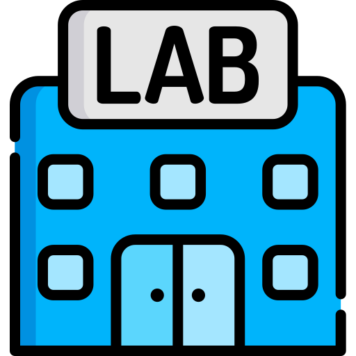

[![Forks][forks-shield]][forks-url]
[![Stargazers][stars-shield]][stars-url]
[![MIT License][license-shield]][license-url]
[![GitHub release][version-shield]][version-url]

<!-- PROJECT LOGO -->
 

  
  <h6>
    <small>
      <a href="https://www.flaticon.com/free-icons/laboratory" title="laboratory icons">Laboratory icons created by Freepik - Flaticon</a>
    </small>
  </h6>

<h3 align="center">Integration Lab</h3>

  

    Example of microservies architecture with integration pattern
     
    <a href="https://github.com/dual-lab/integration-lab"><strong>Explore the docs »</strong></a>
     
     
  

<!-- TABLE OF CONTENTS -->

  
Table of Contents

  <ol>
    <li>
      <a href="#about-the-project">About The Project</a>
      <ul>
        <li><a href="#built-with">Built With</a></li>
      </ul>
    </li>
    <li>
      <a href="#getting-started">Getting Started</a>
      <ul>
        <li><a href="#prerequisites">Prerequisites</a></li>
        <li><a href="#installation">Installation</a></li>
      </ul>
    </li>
    <li><a href="#roadmap">Roadmap</a></li>
    <li><a href="#license">License</a></li>
    <li><a href="#contact">Contact</a></li>
    <li><a href="#acknowledgments">Acknowledgments</a></li>
  </ol>

<!-- ABOUT THE PROJECT -->
## About The Project

[![Product Name Screen Shot][product-screenshot]](https://example.com)

TODO

(<a href="#top">back to top</a>)

### Built With

* [Bazel](https://bazel.build/)
* [Quarkus](https://quarkus.io/)
* [FastAPI](https://fastapi.tiangolo.com/)
* [Gin](https://gin-gonic.com/)

(<a href="#top">back to top</a>)

<!-- GETTING STARTED -->
## Getting Started

TODO

### Prerequisites

TODO

### Installation

TODO

(<a href="#top">back to top</a>)

<!-- USAGE EXAMPLES -->
## Usage

TODO

(<a href="#top">back to top</a>)

<!-- ROADMAP -->
## Roadmap

See the [open issues](https://github.com/dual-lab/integration-lab/issues) for a full list of proposed features (and known issues).

(<a href="#top">back to top</a>)

<!-- LICENSE -->
## License

Distributed under the MIT License. See `LICENSE` for more information.

(<a href="#top">back to top</a>)

<!-- CONTACT -->
## Contact

Dual-lab team - dual-lab@yandex.com

Project Link: [https://github.com/dual-lab/integration-lab](https://github.com/dual-lab/integration-lab)

(<a href="#top">back to top</a>)

<!-- ACKNOWLEDGMENTS -->
## Acknowledgments

* [Apache Camel EIP](https://camel.apache.org/components/3.15.x/eips/enterprise-integration-patterns.html)
* [EIP](https://www.enterpriseintegrationpatterns.com/)
* [Kafka](https://kafka.apache.org/)
* [FastApi](https://fastapi.tiangolo.com/)
* [GIN](https://gin-gonic.com/)

(<a href="#top">back to top</a>)

<!-- MARKDOWN LINKS & IMAGES -->
<!-- https://www.markdownguide.org/basic-syntax/#reference-style-links -->
[forks-shield]: https://img.shields.io/github/forks/dual-lab/integration-lab.svg?style=for-the-badge
[forks-url]: https://github.com/dual-lab/integration-lab/network/members
[stars-shield]: https://img.shields.io/github/stars/dual-lab/integration-lab.svg?style=for-the-badge
[stars-url]: https://github.com/dual-lab/integration-lab/stargazers
[license-shield]: https://img.shields.io/github/license/dual-lab/integration-lab.svg?style=for-the-badge
[license-url]: https://github.com/dual-lab/integration-lab/blob/master/LICENSE
[product-screenshot]: images/screenshot.png
[version-shield]: https://img.shields.io/github/v/release/dual-lab/integration-lab?include_prereleases&sort=semver&style=for-the-badge
[version-url]: https://github.com/dual-lab/integration-lab/releases
